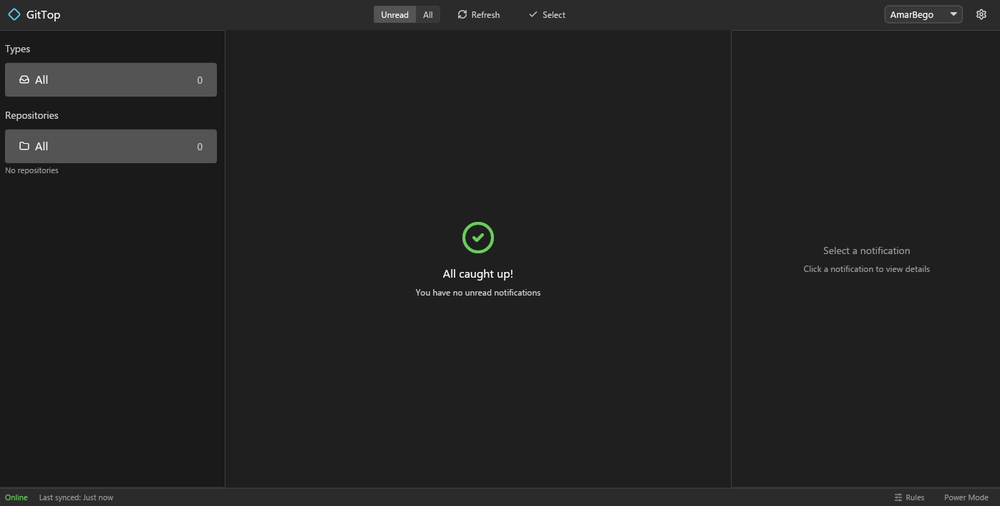

# GitTop

A lightweight desktop client for GitHub notifications. Why spin up a browser just to check your GitHub notifications?

[](LICENSE.md)


## Installation

**[Download pre-built binaries from GitHub Releases](https://github.com/AmarBego/GitTop/releases)**

### Windows

**Scoop:**
```pwsh
Coming soon
```

**Chocolatey:**
```pwsh
choco install gittop
```

**Manual:** Download `gittop-windows-x86_64.zip` from releases, extract, run `gittop.exe`.

### Linux

**Arch Linux (AUR):**
```bash
yay -S gittop-bin
```

**Manual:** Download `gittop-linux-x86_64.tar.gz` from releases:
```bash
tar xzf gittop-linux-x86_64.tar.gz
./gittop-linux-x86_64/gittop
```

## Building from source

Requirements:
- Rust 1.85+ (edition 2024)
- Platform-specific dependencies (see below)

```bash
git clone https://github.com/AmarBego/GitTop.git
cd GitTop
cargo build --release
```

Binary will be at `target/release/gittop` (Linux) or `target\release\gittop.exe` (Windows).

### Platform dependencies

**Linux:**
```bash
# Debian/Ubuntu
sudo apt install libdbus-1-dev

# Fedora
sudo dnf install dbus-devel

# Arch
sudo pacman -S dbus
```

**Windows:** No additional dependencies.

## Development

```bash
# Run in development mode
cargo run

# Run with bacon (recommended for dev)
bacon run

# Format + lint + test (pre-commit)
prek run
```

See [RELEASING.md](RELEASING.md) for version tagging and release process.

## License

AGPL-3.0-only. See [LICENSE.md](LICENSE.md).
